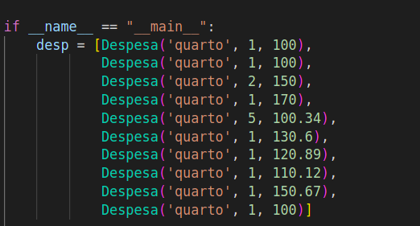
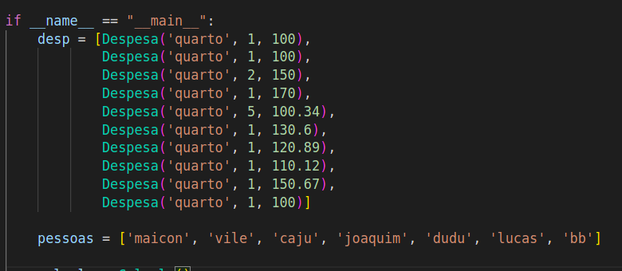

# Tutorial - como rodar o programa

- Clone esse repositório em algum diretório
- Acesse a pasta stone
```bash
cd stone
```
- Crie uma lista de objetos Despesa() que contém: nome, quantidade e preço por unidade dentro do arquivo main.py (exemplo na imagem abaixo)


- Crie uma lista de nomes de pessoas dentro do arquivo main.py


- Para rodar:
```bash
python3 main.py
```
